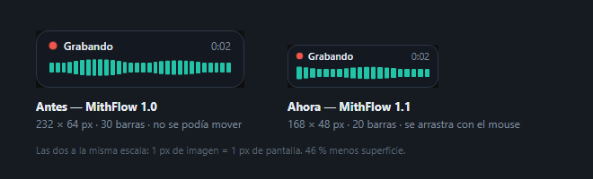

# MithFlow — Dictado por voz 100% local (adiós Wispr Flow, adiós USD 15/mes)

Presionás **F8** → hablás → presionás **F8** de nuevo → el texto aparece donde esté el cursor.
Igual que Wispr Flow, pero tuyo, gratis, offline y con tu vocabulario (MithData, PyME, CRM...).

Incluye un **dashboard** con analíticas de uso: cuánto dictaste, tu velocidad hablando, tiempo ahorrado vs. tipear, y el historial completo buscable.

---

## 🖥️ Hay dos versiones, y conviven

| | **Python** (esta carpeta) | **Nativa** (`app-nativa/`) |
|---|---|---|
| Estado | **la que uso todos los días** | empaquetada y con actualizaciones automáticas (1.1.0) |
| Atajo | **F8** | **F9** |
| Motor | faster-whisper + CUDA (necesita NVIDIA para ir rápido) | whisper.cpp + Vulkan (NVIDIA, AMD o Intel) |
| Instalación | Python 3.10+ y `instalar.ps1` | un instalador `.exe`, sin Python |
| Interfaz | dashboard de Streamlit en el navegador | ventana propia + ícono en la bandeja |
| Historial | `history.jsonl` | `%APPDATA%\com.mithdata.mithflow\history-nativo.jsonl` |

**Las teclas y los archivos son distintos a propósito**: podés tener las dos
corriendo al mismo tiempo sin que una toque los datos de la otra. La versión
Python sigue documentada abajo y no se toca.

### Qué es la app nativa

La misma idea —apretás una tecla, hablás, el texto aparece donde está el
cursor— pero sin Python, sin entorno virtual y sin instalar CUDA. Un solo
instalador que trae el motor de transcripción adentro y **elige solo cómo
acelerar en cada máquina**: Vulkan si la placa lo soporta, y si no, la variante
de CPU que le corresponda al procesador entre nueve posibles. Por eso anda igual
en la máquina con RTX 3080 que en una notebook con gráficos integrados.

Trae además ventana propia con dashboard e historial, ajustes (tecla, sonidos,
vocabulario, arranque con Windows) y un asistente de primer arranque que mide la
máquina y recomienda qué modelo bajar.

**Indicador de grabación.** Al apretar la tecla aparece una ventanita chica
—168 × 48 px, abajo y centrada por defecto— con el nivel de lo que entra por el
micrófono y el tiempo que llevás grabando. Las barras se ponen **teal cuando hay
voz** y **grises cuando sólo hay ruido de fondo**, con el mismo umbral que usa el
motor para decidir si vale la pena transcribir: sirve para darse cuenta de que el
micrófono está silenciado o de que la entrada es el auricular equivocado, sin
tener la ventana abierta. Cuando soltás la tecla se queda en "Transcribiendo…"
hasta que llega el texto.

**Se agarra con el mouse y se mueve.** Si te tapa algo, arrastrala: se queda
donde la dejes, entre dictados y entre reinicios, y en el monitor donde la hayas
soltado. Desde *Ajustes → Indicador de grabación* se vuelve a la posición por
defecto, se cambia la esquina o se apaga del todo. **Nunca toma el foco**: hagas
lo que hagas con ella, el cursor de texto se queda donde estabas escribiendo.
Como contrapartida, los clics ya no la atraviesan — mientras esté encima de un
botón ese botón no se puede apretar, y por eso se puede correr.



### 🖱️ Dos pantallas: hacé clic donde querés el texto

Si trabajás con dos monitores puede pasarte esto: **empezás a dictar en una
pantalla, movés el mouse a la otra y el texto no aparece ahí**. No está roto:
es como funciona Windows, y es lo mismo que hace Wispr Flow.

**Windows le entrega lo que se escribe a la ventana "activa"**, que es aquella
en la que hiciste clic por última vez — la que tiene la barra de título
iluminada y el cursor de texto parpadeando. **Mover el mouse no la cambia**: el
puntero puede pasear por toda la pantalla y lo que escribas sigue yendo al mismo
lado. MithFlow no hace nada distinto de lo que haría tu teclado.

**Qué hacer, entonces:**

1. **Hacé clic en el lugar donde querés el texto** (el campo, el documento, el
   chat). Ahí tiene que quedar el cursor parpadeando.
2. Apretá la tecla y hablá.

Y esto es lo cómodo: **el clic se puede hacer mientras hablás**. Si arrancaste a
dictar y te diste cuenta de que el cursor está en la ventana equivocada, hacé
clic en la correcta sin dejar de hablar y soltá la tecla ahí: el texto se pega
donde hiciste el último clic. El indicador de grabación tampoco te lo va a robar
—está hecho para no tomar nunca el foco—, así que podés moverlo de lugar en el
medio de un dictado y seguir hablando.

> **¿Y por qué no pega donde está el mouse?** Porque cualquier movimiento
> accidental del mouse —o un rincón caliente, o una notificación— mandaría el
> dictado a otro lado. Que mande el clic es lo predecible: el texto sale exacto
> donde saldría si lo estuvieras tecleando.

### Instalación

El instalador se llama **`MithFlow_1.1.0_x64-setup.exe`**. No está en el repo
(pesa de más): lo genera `Generar-Instalador.ps1` y queda en `instalador\`.

Esto es sólo para la **primera** instalación de cada máquina: a partir de ahí
MithFlow se actualiza solo (ver «Actualizaciones automáticas» más abajo).

1. Doble clic en el instalador.
2. ⚠️ **Windows va a mostrar "Windows protegió su PC".** Es esperable y no
   significa que haya un virus: el instalador **no está firmado digitalmente**
   (un certificado de firma cuesta cientos de dólares por año). Hacé clic en
   **"Más información"** —el link chiquito debajo del texto— y después en
   **"Ejecutar de todas formas"**.
3. Se instala **para el usuario actual** en `%LOCALAPPDATA%\MithFlow`, sin pedir
   permisos de administrador. Crea el acceso directo en el menú Inicio, y el del
   escritorio si dejás tildada la casilla de la última pantalla.
4. La primera vez **hay que descargar el modelo**: la app abre un asistente que
   mide la máquina y recomienda cuál. Se guarda en `%APPDATA%\MithFlow\models\`.

Para desinstalar: Configuración → Aplicaciones → MithFlow, o `uninstall.exe` en
la carpeta de instalación.

### Cuánto pesa

| | Tamaño |
|---|---|
| El instalador que se descarga | **12,1 MiB** (12.743.287 bytes) |
| Lo que ocupa ya instalado | **~99 MB** |
| El modelo, aparte y una sola vez | 511 MB – 1,5 GB |

El spec original estimaba "~20 MB" y se quedaba corto en lo instalado: el motor
son **13 DLLs de ggml que suman 84 MB**, y `ggml-vulkan.dll` sola pesa 74 MB
porque lleva los shaders de todas las GPU. Lo que salva el número de la descarga
es que esos shaders comprimen casi 8:1 con LZMA, así que el `.exe` que se baja
son 12 MB aunque en disco queden 99.

### Detalles del primer arranque

- **La primera transcripción de la máquina tarda ~40 s** compilando los shaders
  de Vulkan. La app lo paga sola al arrancar, antes de que dictes; el driver
  guarda el resultado, así que pasa una sola vez por máquina (y de nuevo si
  actualizás el driver de la placa).
- Si Windows no tiene **WebView2** (Windows 11 ya lo trae), el instalador lo
  descarga solo.
- Requiere Windows 10/11 de 64 bits.

---

## 🔄 Actualizaciones automáticas (app nativa)

> **Leelo dentro de seis meses sin acordarte de nada: está escrito para eso.**

### Qué ve el usuario

Al abrir MithFlow, quince segundos después, la app consulta **una sola vez** si
salió una versión nueva. Si hay, aparece una **barrita ámbar** debajo del
encabezado: *"Hay una versión nueva: v1.2.0 (tenés la v1.1.0)"*, con
**Actualizar y reiniciar** y una **×** para descartarla. No es un modal, no
bloquea nada y no vuelve a consultar mientras usás la app.

Al aceptar: baja el instalador, **verifica la firma**, lo aplica y MithFlow se
cierra y vuelve a abrirse solo, ya actualizado.

En **Ajustes → Actualizaciones** están la versión instalada y el botón **Buscar
actualizaciones**, que consulta en el momento.

Tres cosas que **no** pasan nunca:

- **Sin internet no molesta.** La consulta falla, se anota y la app funciona
  igual. Nada del actualizador puede impedir dictar.
- **No interrumpe un dictado.** Grabando o transcribiendo no avisa y no
  instala; si la descarga termina justo cuando arrancaste a dictar, se frena
  antes de instalar.
- **No baja de versión.** Si el manifiesto anuncia una versión que no es más
  nueva que la instalada, no se ofrece nada.

Si corrés MithFlow desde una copia de desarrollo (`target\release\`) en vez de
la instalación, Ajustes lo dice con todas las letras: no hay nada que
actualizar.

### ⚠️ El repositorio de GitHub: ya está configurado, y falta crearlo

La app viene apuntando a:

```
https://github.com/LucasPilla60/mithflow/releases/latest/download/latest.json
```

**Falta el paso que no hace el código: crear ese repositorio en tu cuenta**, con
el nombre `mithflow`, y publicar ahí las releases (ver más abajo). Hasta que
exista, la consulta de actualizaciones devuelve 404, se anota y la app sigue
funcionando igual: nada del actualizador puede impedir dictar.

**Si preferís otro nombre**, se cambia en **un solo lugar**:

**Archivo:** `app-nativa/app/src-tauri/tauri.conf.json`
**Dónde:** `plugins` → `updater` → `endpoints`

```json
"endpoints": [
  "https://github.com/LucasPilla60/mithflow/releases/latest/download/latest.json"
]
```

`Generar-Instalador.ps1` lee esa URL y deriva de ahí la de descarga del
instalador, así que **no hay un segundo lugar** donde el nombre del repositorio
pueda quedar mal.

Esa URL queda grabada dentro del `.exe`: después de cambiarla hay que volver a
compilar para que las instalaciones nuevas sepan a dónde consultar (y las que ya
están instaladas van a seguir consultando la vieja hasta que actualicen una vez).
El repositorio puede ser público o privado, pero si es privado las releases no
son descargables sin credenciales y el actualizador no va a poder bajar nada.

### Publicar una versión nueva

**Un comando:**

```powershell
.\Generar-Instalador.ps1 -Version 1.2.0 -Notas "Qué cambió en esta versión."
```

(Clic derecho → *Ejecutar con PowerShell* también sirve, pero ahí no se puede
pasar la versión: recompila la que ya está.)

El script hace todo solo:

1. Corta si el endpoint del actualizador no tiene forma de URL de GitHub (o si
   todavía dijera `REEMPLAZAR`, que ya no es el caso).
2. Escribe la versión en los **tres** archivos que la llevan
   (`app-nativa/Cargo.toml`, `app-nativa/app/package.json`,
   `app-nativa/app/src-tauri/tauri.conf.json`) y **los relee para verificar que
   quedaron iguales**. Si se desincronizan, el actualizador se rompe de formas
   confusas.
3. Compila.
4. Firma el instalador con la clave privada minisign.
5. Deja en `instalador\` los **dos archivos que hay que subir**.

**Después, a mano en GitHub** (esto no lo hace el script):

1. *Releases* → *Draft a new release*.
2. La etiqueta tiene que ser **exactamente `v` + la versión**: para la 1.2.0, la
   etiqueta es `v1.2.0`. Si no, la URL del manifiesto apunta a la nada.
3. Adjuntá los **dos** archivos de `instalador\`, con esos nombres:
   - `MithFlow_1.2.0_x64-setup.exe`
   - `latest.json`
4. **Publicala**, no la dejes en borrador: `/releases/latest/` no ve los
   borradores y la consulta devolvería 404.

Las instalaciones existentes ven la actualización la próxima vez que abran
MithFlow.

### 🔑 La clave privada: dónde está y qué pasa si se pierde

```
%USERPROFILE%\.mithflow\mithflow-updater.key       ← la privada (SECRETA)
%USERPROFILE%\.mithflow\mithflow-updater.key.pub   ← la pública (copiada ya en tauri.conf.json)
```

En esta máquina: `C:\Users\lucas\.mithflow\`.

**Está fuera del proyecto a propósito.** Adentro, cualquier `git add -A`
distraído la publicaría para siempre en un repo público, y quien la tenga puede
firmar un instalador que las tres máquinas van a bajar y ejecutar solas, sin
preguntar nada. No hay forma de revocarla. El `.gitignore` tiene además
`*.key`, `*.pem` y compañía como segunda red, por si alguna vez la copiás al
árbol "un minuto para probar algo".

**La clave pública sí es pública**: está en `tauri.conf.json` y tiene que estar
ahí, es la que verifica la firma. No es un secreto.

#### Si se pierde la clave privada

**Nadie puede volver a actualizar las instalaciones que ya están afuera.**

Se puede generar una clave nueva y poner la pública nueva en `tauri.conf.json`,
pero las copias ya instaladas siguen buscando la firma de la clave vieja y
**van a rechazar todo lo que se publique**. La única salida es ir a las tres
máquinas y **reinstalar a mano** con el instalador nuevo.

Por eso: **respaldala.** Copiá esos dos archivos a donde guardes lo importante
(gestor de contraseñas, disco externo, lo que uses). Son 500 bytes.

```powershell
# Generar el par de nuevo (sólo si la perdiste y ya asumiste el costo de arriba)
cd app-nativa\app
npm run tauri --silent -- signer generate --ci --password= -w "$env:USERPROFILE\.mithflow\mithflow-updater.key"
```

Después hay que copiar el contenido de `mithflow-updater.key.pub` al campo
`pubkey` de `tauri.conf.json`.

#### Sobre la contraseña de la clave

La clave se generó **sin contraseña**, para que publicar sea un comando y no un
comando más una contraseña que nadie va a recordar. El costo es real: quien
consiga el archivo puede firmar actualizaciones sin nada más. Como el archivo
vive en el perfil de usuario de esta máquina y nunca sale de ahí, el riesgo es
"alguien con acceso a esta computadora", que ya podría hacer cosas peores.

Si preferís ponerle contraseña, generá el par con `--password "loquesea"` en vez
de `--password=`, y en `Generar-Instalador.ps1` cambiá el `--password=` del paso
de firma por `--password "loquesea"`. **No la escribas en el script**: se
commitea junto con él y no habrías ganado nada.

#### Esto NO es la firma de código de Windows

Son dos cosas distintas:

| | Firma minisign (esto) | Firma de código (SmartScreen) |
|---|---|---|
| Para qué | que la app confíe en la actualización | que Windows confíe en el instalador |
| Cuesta | nada | cientos de dólares por año |
| Estado | **hecha** | no la tenemos |

Al instalar a mano se va a seguir viendo "Windows protegió su PC" (ese aviso lo
dispara la marca que el navegador le pone a lo que bajás). Al **actualizar**
desde la app el instalador no pasa por el navegador, así que lo esperable es que
no aparezca — pero no está verificado en las tres máquinas, así que si en alguna
sale, es eso y no un problema: **Más información → Ejecutar de todas formas**.

---

## 📦 Instalación en otra PC o notebook (versión Python)

Funciona con o sin GPU. Toda la instalación son 3 pasos.

### Paso 1 — Instalar Python (una sola vez por máquina)
Descargá **Python 3.10 o superior** desde https://python.org.
⚠️ Al instalar, **tildá la casilla "Add python.exe to PATH"** (abajo de todo en la primera pantalla). Sin eso el instalador no lo encuentra.

### Paso 2 — Copiar los archivos
Copiá la carpeta `MithFlow` completa a la otra máquina (por pendrive, red o la nube).

**No copies estas carpetas/archivos** — se regeneran solos y ocupan de más:
| No copiar | Por qué |
|---|---|
| `.venv\` | Entorno virtual, se recrea en la otra PC (y tiene rutas absolutas de esta) |
| `__pycache__\` | Caché de Python |
| `history.jsonl` | **Tu historial de dictados** — es privado, no lo lleves a otra máquina |
| `*.log`, `status.json` | Archivos temporales |

Los que **sí** necesitás:
```
mithflow.py              el motor de dictado
dashboard.py             el dashboard de analíticas
requirements.txt         lista de dependencias
instalar.ps1             el instalador
MithFlow-App.vbs         lanzador principal (motor + dashboard)
MithFlow.bat             lanzador con consola visible
MithFlow-invisible.vbs   lanzador solo motor, sin ventana
Detener-MithFlow.bat     para apagarlo
.streamlit\config.toml   tema del dashboard + binding a localhost
```

### Paso 3 — Ejecutar el instalador
Clic derecho en **`instalar.ps1`** → **Ejecutar con PowerShell**.

> Si Windows bloquea el script ("la ejecución de scripts está deshabilitada"), abrí PowerShell en la carpeta y corré:
> `powershell -ExecutionPolicy Bypass -File instalar.ps1`

El instalador hace todo solo:
1. Verifica que Python sea 3.10+
2. Crea el entorno virtual e instala las dependencias
3. **Detecta si hay GPU NVIDIA**: si hay, instala las librerías CUDA y usa el modelo grande (`large-v3-turbo`); si no, usa `small` en CPU
4. Crea la config del dashboard (con acceso restringido a esa máquina)
5. Verifica que el micrófono y las dependencias funcionen
6. Pregunta si querés Ollama (**opcional** — ver más abajo)

### Listo: doble clic en `MithFlow-App.vbs`
La primera corrida descarga el modelo Whisper (1-2 GB, una sola vez) — tarda unos minutos. Las siguientes arrancan en ~30 segundos.

---

### ¿Cuánta máquina necesito?

| | Con GPU NVIDIA | Solo CPU |
|---|---|---|
| Modelo | `large-v3-turbo` | `small` |
| Latencia | ~0.3s | ~2-4s según el procesador |
| RAM/VRAM | ~2 GB VRAM | ~2 GB RAM |
| Calidad en español | Excelente | Muy buena |

No hace falta tocar nada: `MODEL_SIZE = "auto"` elige solo según lo que encuentre. En una notebook sin GPU anda perfecto, solo esperás un par de segundos más.

### Ollama: cuándo sí y cuándo no
Por default **no hace falta** — la limpieza rápida por reglas (`CLEANUP_MODE = "fast"`) saca muletillas y arregla el espaciado en menos de 1 ms. Instalá Ollama solo si querés que un LLM reescriba y pula la redacción entera; cuesta ~3.5s por dictado. En notebooks sin GPU, mejor no.

### Problemas comunes

| Síntoma | Solución |
|---|---|
| "Python no está instalado o no está en el PATH" | Reinstalá Python tildando "Add python.exe to PATH" |
| `cublas64_12.dll is not found` | Faltan las librerías CUDA: `.venv\Scripts\python.exe -m pip install nvidia-cublas-cu12 nvidia-cudnn-cu12` |
| F8 suena pero no pega | Verificá que haya **una sola** instancia (`Detener-MithFlow.bat` y relanzá). Revisá `mithflow.log` |
| No detecta micrófono | Configuración de Windows → Sistema → Sonido → Entrada; y permitir acceso al micrófono a apps de escritorio |
| El dashboard no abre | Esperá ~10s tras el doble clic; entrá a mano a http://localhost:8501 |
| Suena un beep grave al iniciar | Ya hay otro MithFlow corriendo; el nuevo se cierra solo (es lo correcto) |

---

## 🎙️ Uso diario

| Archivo | Qué hace |
|---|---|
| **`MithFlow-App.vbs`** ⭐ | App completa: motor F8 de fondo + dashboard como ventana de aplicación |
| `MithFlow.bat` | Solo motor, con consola visible (útil para ver errores) |
| `MithFlow-invisible.vbs` | Solo motor, sin ventana; logs en `mithflow.log` |
| `Detener-MithFlow.bat` | Apaga el motor |

**Arranque automático con Windows:** `Win+R` → `shell:startup` → pegá ahí un acceso directo a `MithFlow-invisible.vbs` (o a `MithFlow-App.vbs` si querés también el dashboard).

Una sola instancia a la vez: si lanzás un segundo MithFlow, suena un tono grave y se cierra solo.

---

## ⚙️ Configuración (bloque CONFIGURACIÓN en `mithflow.py`)

| Variable | Qué toca |
|---|---|
| `HOTKEY` | Tecla de dictado (default `F8`) |
| `MODEL_SIZE` | `"auto"` elige según GPU. Fijalo a `small`/`medium`/`large-v3-turbo` si querés |
| `INITIAL_PROMPT` | **Tu vocabulario propio** — agregá términos que Whisper suele errar |
| `CLEANUP_MODE` | `"fast"` (default, instantáneo) · `"llm"` (Ollama, +3.5s) · `"off"` (crudo) |
| `FILLERS` | Muletillas que saca el modo `fast` |
| `BEAM_SIZE` | `1` (default, rápido) o `5` si notás errores en audio difícil |

---

## 📊 Latencia (medido en RTX 3080, 21/7/2026)

| Configuración | Transcripción | Limpieza | Total |
|---|---|---|---|
| `fast` + beam 1 (**actual**) | 0.30s | 0.002s | **0.31s** |
| `llm` + beam 5 (anterior) | 0.53s | 3.55s | 4.08s |

El cuello de botella era el LLM: tardaba ~3.5s casi sin importar el largo del texto (overhead de arranque, no trabajo real). El modo `fast` limpia por reglas en menos de 1 ms, y Whisper ya puntúa y capitaliza bien por su cuenta.

`BEAM_SIZE = 1` da transcripción idéntica a `5` y es 28% más rápido (verificado con voz real en español generada por TTS).

---

## 🔊 Sonidos

Tonos suaves sintetizados (no los beeps estridentes de Windows). Para cambiarlos, editá las funciones `beep_*` en `mithflow.py`:

| Sonido | Cuándo |
|---|---|
| Acorde ascendente | Empezó a grabar |
| Tono grave corto | Dejó de grabar |
| Campanita | Texto pegado |
| Grave largo | Error / ya hay otra instancia |

Bajá `vol` en `play_tone()` si los querés aún más discretos (default `0.15`).

---

## 🔒 Privacidad

- **Todo corre local**: tu voz nunca sale de la máquina. Sin nube, sin cuenta, sin telemetría.
- El dashboard escucha **solo en `127.0.0.1`** (`.streamlit\config.toml`): nadie más en tu red puede verlo. **No cambies `server.address` a `0.0.0.0`** — `history.jsonl` guarda en texto plano todo lo que dictaste.
- `history.jsonl` es privado: no lo copies entre máquinas ni lo subas a ningún lado. Para borrar tu historial, borrá el archivo.

---

## 🔧 Notas técnicas

- `vad_filter=True` recorta silencios antes de transcribir (más rápido y menos alucinación).
- El script preserva tu portapapeles: copia el texto, pega con Ctrl+V y restaura lo que tenías.
- El hotkey usa `suppress=True`: F8 no llega a la app enfocada, así el cursor no se mueve de donde estaba.
- La limpieza `fast` es conservadora por diseño: si las reglas se comen más de la mitad del texto, devuelve el original. No saca `"bueno"`, `"nada"` ni `"a ver"` porque también son arranques legítimos.
- En modo `llm`, si el modelo devuelve algo vacío o de largo desproporcionado se descarta y se usa el texto crudo. El LLM nunca puede "inventar" tu dictado.
- El motor escribe un latido en `status.json` cada 10s; así el dashboard sabe si está vivo sin inspeccionar procesos.

---

## ✅ Estado (22/7/2026)

**Python:** funcionando end-to-end en Windows 11 + RTX 3080 — dictado, pegado, sonidos, dashboard y analíticas. Probado con micrófono real.

**Nativa:** instalador **1.1.0** generado y firmado, con actualizaciones automáticas contra GitHub Releases y el indicador de grabación chico y arrastrable. La 1.0.0 se verificó en instalación limpia (arranca, carga el motor por Vulkan y queda lista); el dictado real con micrófono todavía no se probó en la versión nativa.

**Falta crear el repositorio** `LucasPilla60/mithflow` en GitHub y publicar ahí la release `v1.1.0` con los dos archivos de `instalador\`. Hasta entonces la consulta de actualizaciones devuelve 404 y la app funciona igual.

**Ojo con la 1.0.0:** no tiene actualizador, así que las máquinas que la tengan instalada **no** van a recibir la 1.1.0 solas. Hay que instalarla a mano una vez en cada una; de ahí en adelante sí se actualizan solas.

## 🗺️ Roadmap

1. Modo push-to-talk (mantener presionado) en vez de toggle.
2. Perfiles de limpieza por app (email formal vs. chat casual) — lo que Wispr llama "tone matching".
3. ~~Empaquetarlo como .exe con ícono en la bandeja del sistema~~ — **hecho**, pero por otro camino: en vez de PyInstaller + pystray se reescribió el motor en Rust (`app-nativa/`), que además saca la dependencia de CUDA. Ver la sección de la app nativa arriba.
4. Migrar a Parakeet v3 (más rápido que Whisper, ya soporta español) para exprimir aún más la latencia.
5. **Firmar el instalador nativo** para que Windows deje de mostrar SmartScreen.
6. En la app nativa, aplicar de verdad los tres ajustes que hoy sólo se guardan (vocabulario, muletillas, modo de limpieza).

---

## Alternativa: Handy (si no querés mantener código)

**https://handy.computer** — app open source ya hecha (Whisper local, Windows/Mac/Linux). Se instala en 10 minutos y transcribe muy bien, pero no tiene limpieza de muletillas, vocabulario propio ni dashboard. Es el plan B si algún día no querés seguir con esto.
