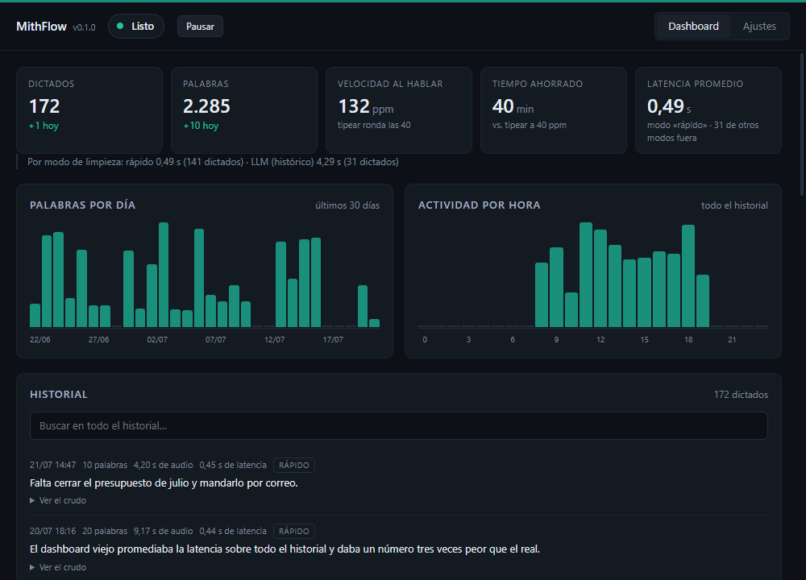
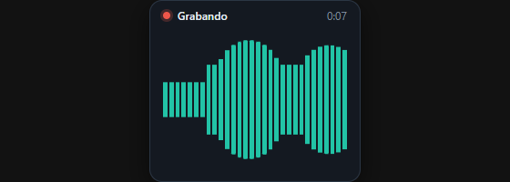
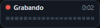
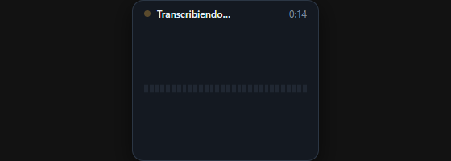
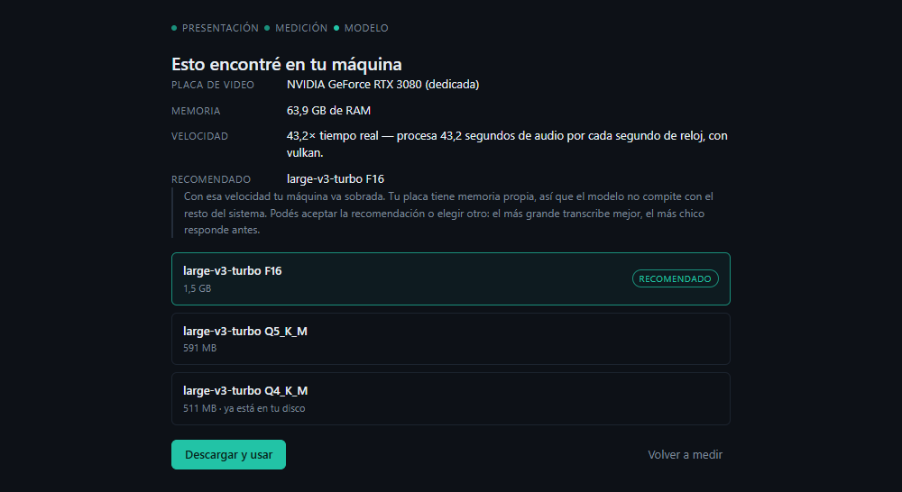
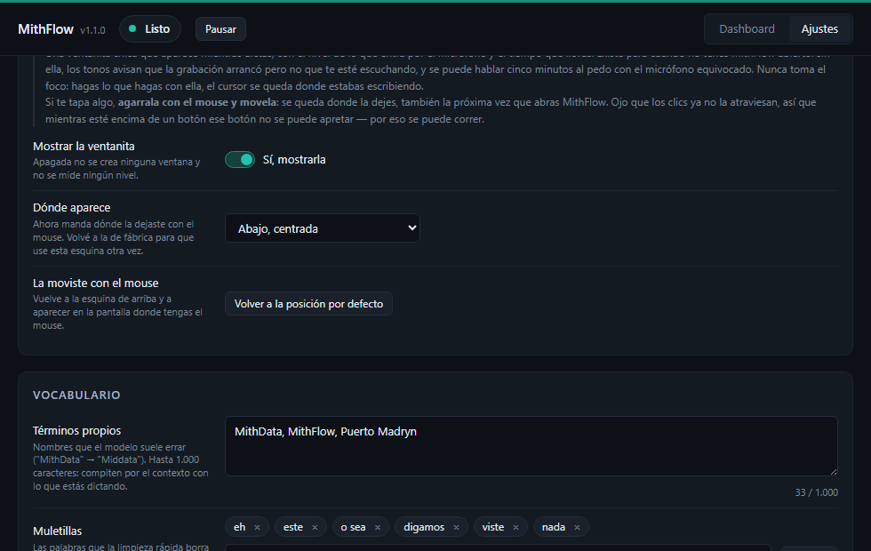
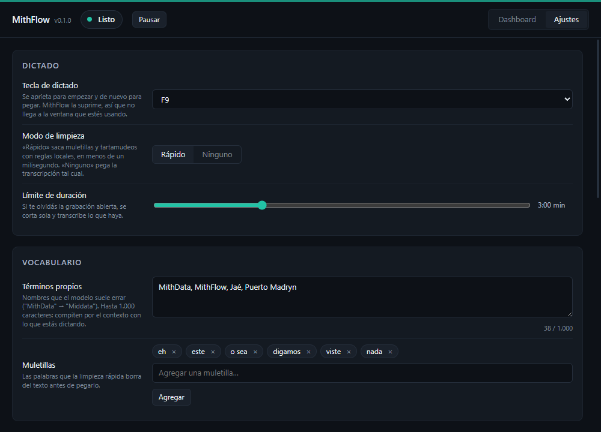
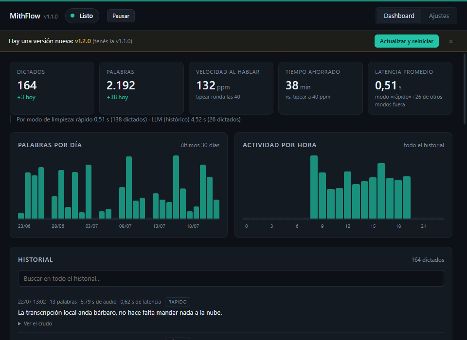

# MithFlow

**Dictado por voz para Windows, 100% local.** Apretás una tecla, hablás,
apretás de nuevo, y el texto transcripto aparece donde tengas el cursor. En
cualquier aplicación. Sin nube, sin cuenta y sin suscripción: el audio se
procesa en tu máquina y no sale de ahí.



<p align="center">
  
  &nbsp;&nbsp;
  
  &nbsp;&nbsp;
  
</p>

<p align="center"><em>La ventanita de grabación: teal cuando te escucha, gris cuando sólo hay ruido.</em></p>

---

## Por qué existe

[Wispr Flow](https://wisprflow.ai) hace esto muy bien y cuesta unos USD 15 por
mes. A cambio, tu voz viaja a un servidor ajeno: todo lo que dictás —notas,
mensajes, documentos de trabajo, cosas de clientes— pasa por una máquina que no
controlás.

MithFlow hace lo mismo con un modelo de transcripción corriendo en tu propia
computadora. No cuesta nada, no hay cuenta que crear, y funciona con el cable de
red desenchufado. La contrapartida honesta es que la primera vez hay que bajar
un modelo de entre 511 MB y 1,5 GB, y que sólo funciona en Windows.

## Qué hace

- **Dictado con atajo global.** Una tecla (F9 por defecto, configurable) empieza
  y termina la grabación desde cualquier aplicación.
- **Pega donde está el cursor.** No hay que copiar nada a mano: el texto entra
  donde estabas escribiendo, y el portapapeles queda como estaba.
- **Limpia el texto.** Saca muletillas (`eh`, `este`, `o sea`…) y tartamudeos
  (`el el informe`) con reglas locales, en menos de un milisegundo.
- **Vocabulario propio.** Los términos que el modelo suele errar —nombres de
  productos, jerga, siglas— se le pasan como contexto y deja de inventarlos.
- **Dashboard con métricas.** Cuánto dictaste, tu velocidad hablando, el tiempo
  ahorrado contra tipear, y el historial completo buscable.
- **Indicador flotante con vúmetro.** Una ventanita chica que muestra que te
  está escuchando de verdad, sin tener que abrir la app.
- **Actualizaciones automáticas firmadas.** La app avisa cuando hay versión
  nueva y se actualiza sola, verificando la firma antes de instalar nada.
- **Offline.** Ni el audio ni el texto salen de la máquina. La red se usa sólo
  para bajar el modelo la primera vez y para consultar si hay versión nueva.

---

## Requisitos

- **Windows 10 u 11, 64 bits.**
- ~99 MB de disco para el programa, más el modelo (511 MB – 1,5 GB, una sola
  vez).
- Un micrófono.
- **GPU: opcional.**

### Anda con o sin placa de video

El motor usa **Vulkan**, que no es exclusivo de ninguna marca: acelera igual en
**NVIDIA, AMD o Intel**, incluidos los gráficos integrados de una notebook. Y si
en la máquina no hay nada usable —driver viejo, integrada sin soporte de
cómputo— **cae a CPU sin que haya que configurar nada**.

Un solo instalador cubre los tres casos. Adentro viajan los shaders de Vulkan y
**nueve variantes compiladas del backend de CPU** (`sse42`, `sandybridge`,
`haswell`, `skylakex`, `icelake`, `cascadelake`, `cannonlake`, `alderlake`,
`x64`); al arrancar se carga la que corresponde a ese procesador. Por eso el
mismo `.exe` anda en un escritorio con placa dedicada y en una notebook con
gráficos integrados.

En una máquina lenta el dictado tarda más, y eso es todo: no deja de funcionar.
El asistente de primer arranque lo tiene en cuenta y baja un modelo más chico
(ver más abajo).

---

## Instalación

1. Bajá el instalador de la [página de
   Releases](https://github.com/LucasPilla60/mithflow/releases/latest):
   `MithFlow_<versión>_x64-setup.exe`. Son unos 12,5 MB.
2. Doble clic.
3. **Windows va a mostrar "Windows protegió su PC".** Es esperable: el
   instalador **no está firmado digitalmente** (un certificado de firma de
   código cuesta cientos de dólares por año). Hacé clic en **"Más
   información"** —el link chiquito debajo del texto— y después en **"Ejecutar
   de todas formas"**.
4. Se instala **para el usuario actual** en `%LOCALAPPDATA%\MithFlow`, sin pedir
   permisos de administrador. Crea el acceso directo en el menú Inicio, y el del
   escritorio si dejás tildada la casilla de la última pantalla.
5. Si Windows no tiene **WebView2** (Windows 11 ya lo trae), el instalador lo
   descarga solo.

De ahí en adelante MithFlow se actualiza solo: esto es sólo para la primera
instalación de cada máquina.

### El asistente de primer arranque

La primera vez hay que descargar un modelo, y la app abre un asistente que
**mide tu máquina antes de recomendarte cuál**:



Baja el modelo más chico (511 MB), transcribe con él un audio de referencia y
cronometra cuántos segundos de audio procesa por segundo de reloj. Con ese
número —y con la RAM disponible— elige entre tres modelos. Podés aceptar la
recomendación o elegir otro: el más grande transcribe mejor, el más chico
responde antes.

Los modelos quedan en `%APPDATA%\MithFlow\models\`.

> **La primera transcripción de cada máquina tarda entre veinte segundos y un
> minuto** compilando los shaders de Vulkan. La app lo paga sola al arrancar,
> antes de que dictes; el driver guarda el resultado, así que pasa una sola vez
> por máquina (y de nuevo si actualizás el driver de la placa).

Para desinstalar: **Ajustes → Desinstalar MithFlow**, que además te deja elegir
si borrar los modelos y el historial; o Configuración → Aplicaciones → MithFlow,
que saca el programa y deja los datos.

---

## Uso

1. **Hacé clic donde querés que aparezca el texto** (el campo, el documento, el
   chat). Ahí tiene que quedar el cursor parpadeando.
2. **Apretá F9** y hablá.
3. **Apretá F9 de nuevo.** El texto se pega solo.

La tecla se cambia desde Ajustes. MithFlow la **suprime**: no llega a la
aplicación que tengas enfocada, así que apretarla no mueve nada de lugar.

### Sobre el foco: el texto va a la ventana en la que hiciste clic

Si trabajás con dos monitores puede pasarte esto: empezás a dictar en una
pantalla, movés el mouse a la otra y el texto no aparece ahí. **No está roto.**

Windows le entrega lo que se escribe a la ventana **activa**, que es aquella en
la que hiciste clic por última vez —la que tiene la barra de título iluminada y
el cursor de texto parpadeando—. **Mover el mouse no la cambia.** MithFlow no
hace nada distinto de lo que haría tu teclado, y es lo mismo que hace Wispr
Flow.

Lo cómodo es que **el clic se puede hacer mientras hablás**: si arrancaste a
dictar y te diste cuenta de que el cursor está en la ventana equivocada, hacé
clic en la correcta sin dejar de hablar y soltá la tecla ahí. El texto se pega
donde hiciste el último clic.

> **¿Y por qué no pega donde está el mouse?** Porque cualquier movimiento
> accidental del mouse mandaría el dictado a otro lado. Que mande el clic es lo
> predecible: el texto sale exacto donde saldría si lo estuvieras tecleando.

### La ventanita de grabación

Al apretar la tecla aparece un indicador chico —168 × 48 px, abajo y centrado
por defecto— con el nivel de lo que entra por el micrófono y el tiempo que
llevás grabando.

Las barras se ponen **teal cuando hay voz** y **grises cuando sólo hay ruido de
fondo**, con el mismo umbral que usa el motor para decidir si vale la pena
transcribir. Sirve para darte cuenta de que el micrófono está silenciado o de
que la entrada es el auricular equivocado, sin tener la ventana abierta. Cuando
soltás la tecla se queda en "Transcribiendo…" hasta que llega el texto.


**Se agarra con el mouse y se mueve.** Si te tapa algo, arrastrala: se queda
donde la dejes, entre dictados y entre reinicios, y en el monitor donde la hayas
soltado. **Nunca toma el foco**: hagas lo que hagas con ella, el cursor de texto
se queda donde estabas escribiendo. Como contrapartida, los clics ya no la
atraviesan — mientras esté encima de un botón, ese botón no se puede apretar, y
por eso se puede correr.

Desde *Ajustes → Indicador de grabación* se vuelve a la posición por defecto, se
cambia la esquina o se apaga del todo. Apagado no cuesta nada: ni ventana, ni
eventos, ni ciclos en el camino del audio.



### Ajustes



Tecla de dictado, modo de limpieza, límite de duración de la grabación,
vocabulario propio, muletillas, modelo, sonidos, arranque con Windows, posición
del indicador, borrado del historial y desinstalación.

### Actualizaciones automáticas



Al abrir MithFlow, quince segundos después, la app consulta **una sola vez** si
salió una versión nueva. Si hay, aparece una barrita ámbar debajo del
encabezado, con **Actualizar y reiniciar** y una **×** para descartarla. No es un
modal y no bloquea nada.

Al aceptar: baja el instalador, **verifica la firma criptográfica**, lo aplica y
MithFlow se cierra y vuelve a abrirse solo, ya actualizado.

Tres cosas que **no** pasan nunca:

- **Sin internet no molesta.** La consulta falla, se anota y la app funciona
  igual. Nada del actualizador puede impedir dictar.
- **No interrumpe un dictado.** Grabando o transcribiendo no avisa y no
  instala; si la descarga termina justo cuando arrancaste a dictar, se frena
  antes de instalar.
- **No baja de versión.** Si el manifiesto anuncia una versión que no es más
  nueva que la instalada, no se ofrece nada.

En **Ajustes → Actualizaciones** están la versión instalada y un botón para
consultar en el momento.

---

## Cómo funciona por dentro

Un solo ejecutable: núcleo en **Rust**, interfaz en **React + TypeScript**
adentro de **Tauri v2**. Sin procesos separados, sin servidor HTTP y sin
navegador. Cinco hilos que se hablan por canales, con un único escritor del
estado.

### El motor: whisper.cpp con backends dinámicos

La transcripción la hace **whisper.cpp** a través del crate
[`transcribe-cpp`](https://crates.io/crates/transcribe-cpp), con las features
`dynamic-backends` y `vulkan`. Los backends de ggml no van compilados adentro
del binario: son **13 DLLs sueltas** que se instalan al lado del ejecutable, y
al arrancar se carga la que sirva en esa máquina —Vulkan si la placa lo soporta,
y si no la variante de CPU que le corresponda al procesador—.

Ésa es la razón de que un solo instalador ande en cualquier máquina, y también
del 91% de su peso: `ggml-vulkan.dll` sola pesa 74 MB porque lleva los shaders
de todas las GPU.

El modelo es **Whisper large-v3-turbo** en formato GGUF, en tres cuantizaciones
(`F16`, `Q5_K_M`, `Q4_K_M`). Se descarga aparte y se **verifica por SHA-256**
contra un hash compilado dentro del binario: un hash servido por el mismo host
que el modelo no verifica nada. Un archivo que no verifica no se da por bueno y
tampoco se borra —puede ser una copia que trajiste a mano—: se aparta como
`.gguf.invalido`.

### La elección del modelo: por medición, no por especificaciones

Es la decisión de diseño más útil del proyecto. Mirar las especificaciones de la
placa **no funciona**: una integrada AMD reporta ~128 MB de "VRAM dedicada" por
DXGI, así que una matriz de umbrales la mandaría a la rama "sin GPU utilizable"
aunque Vulkan corra perfecto ahí.

Entonces no se pregunta: **se mide**. La app baja el modelo más chico,
transcribe con él un clip de referencia de 9,5 segundos y calcula el factor de
tiempo real (segundos de audio por segundo de reloj). Con eso, y con la RAM del
sistema, elige.

Hay una sutileza que costó encontrarla, y vale para cualquiera que copie el
método: **el clip de referencia ES la calibración**. Whisper rellena toda entrada
hasta 30 s antes del codificador, así que el tiempo de inferencia es casi
independiente de lo que dure el clip. Con un clip de 3 s en vez de 9,5 s, la
máquina de referencia —la misma que hace 9,5 s de audio en 0,221 s—
**no calificaba para el modelo grande**: el mismo costo fijo dividido por 3 en
vez de por 9,5 desinfla el factor unas tres veces. En un modelo con ventana de
entrada fija, un "factor de tiempo real" no es una propiedad de la máquina sola,
sino del par (máquina, duración del clip).

### La limpieza: reglas, no un LLM

El prototipo usaba un LLM local (Ollama) para pulir la redacción. Se sacó porque
**tardaba ~3,5 s casi sin importar el largo del texto** (overhead de arranque,
no trabajo real), contra menos de 1 ms de un puñado de expresiones regulares. Y
Whisper ya puntúa y capitaliza bien por su cuenta.

Las reglas son deliberadamente conservadoras: si se comen más de la mitad del
texto, devuelven el original. La lista de fábrica no saca `"bueno"`, `"nada"` ni
`"a ver"`, porque también son arranques legítimos y sacarlos cambia el tono.

### Antes del modelo hay una compuerta de energía

Whisper alucina sobre silencio y sobre ruido: devuelve frases de los subtítulos
con los que se entrenó ("gracias por ver el video"). Se barrieron seis
combinaciones de sus umbrales internos (`no_speech_thold` × `logprob_thold`) y
**todas alucinaron**; sobre ruido inventa cadenas distintas cada vez, así que
una lista de bloqueo tampoco cierra.

La solución es una **compuerta de RMS antes del modelo**, que es determinista y
no puede inventar texto. Medido sobre fixtures de 10 s: silencio `0.000000`,
ruido de fondo `0.002891`, voz `0.071`–`0.101`. El umbral quedó en `0.01`,
deliberadamente por debajo del punto medio geométrico: entre transcribir ruido y
perder un dictado flojo, el error caro es el segundo.

### El atajo suprime la tecla

El hook global es [`rdev`](https://crates.io/crates/rdev) con la feature
`unstable_grab`, en un hilo dedicado. `grab` no sólo escucha: **se come la
tecla**, así que no llega a la aplicación enfocada y el cursor de texto no se
mueve de donde estaba.

Cómo se verificó, porque la primera prueba no servía: se probó con el Bloc de
notas y eso **no prueba nada** —F9 no hace nada ahí, así que "no pasó nada" es
idéntico tanto si la tecla se suprimió como si llegó y la app la ignoró—. La
prueba concluyente fue **VS Code, donde F9 pone o saca un breakpoint**: efecto
visible e inequívoco. La consola registró la tecla capturada y no apareció
ningún breakpoint.

> Para verificar supresión de teclas hay que elegir una aplicación donde esa
> tecla tenga un efecto observable. Un objetivo que la ignora da un falso
> positivo.

El callback corre en el camino crítico del teclado: si tarda más que
`LowLevelHooksTimeout` (300 ms), Windows lo desengancha sin avisar. Por eso sólo
hace operaciones atómicas y un `send` que no bloquea.

### El indicador no puede robar el foco

Una ventanita que se lleve el foco mueve el cursor de texto y el dictado termina
en otro lado, que es exactamente el defecto que la supresión de la tecla
resuelve. La garantía la da `WS_EX_NOACTIVATE` (vía `focusable(false)`), y se
midió con Win32 en un spike aparte (`app-nativa/spike-superpuesta/`), con un
**testigo** —una ventana igual pero sin ese estilo— para probar que el aparato
de medición detecta un robo de foco cuando lo hay.

De ahí salió un hallazgo que habría mordido en producción: `focused(false)` sin
`focusable(false)` habría robado el foco **a partir de la segunda grabación**,
porque `tao` consume la marca `MARKER_DONT_FOCUS` en el primer `show` y después
vuelve a `SW_SHOW`. La primera grabación se habría visto bien; de la segunda en
adelante, el cursor se iría del campo de texto.

### El pegado espera una confirmación, no un `sleep`

El prototipo copiaba al portapapeles, dormía 150 ms, mandaba Ctrl+V y dormía
300 ms más. La versión nativa espera el **número de secuencia del portapapeles**,
que es la señal real de que la copia se aplicó: 460 ms de esperas fijas se
convirtieron en ~2,5 ms de espera confirmada.

Queda un margen fijo de 120 ms antes de restaurar el portapapeles, y es
empírico: no hay señal del sistema que diga "la app destino ya procesó el
Ctrl+V".

---

## Números medidos

Todos salen de mediciones reproducibles, no de estimaciones. El protocolo y los
porqués están en [`app-nativa/DECISIONES.md`](app-nativa/DECISIONES.md).

### Transcripción — Vulkan resultó más rápido que CUDA

Mismo audio (WAV de voz sintética de 9,5 s), mismo escritorio (RTX 3080),
modelo caliente:

| Implementación | Backend | Transcripción |
|---|---|---|
| Prototipo Python + faster-whisper | CUDA, float16 | 0,280 s (mediana, N=20) |
| **Rust + `transcribe-cpp`** | **Vulkan** | **0,221 s** (mediana, 5 pasadas) |

Un **21% más rápido**, contra el 25-30% *más lento* que preveía el diseño. La
causa probable es que whisper.cpp con Vulkan usa los matrix cores
(`NV_coopmat2`) y el GGUF F16 en lugar de la conversión de CTranslate2. El dato
importa porque significa que **no hace falta compilar con CUDA**: un único
binario con Vulkan cumple.

### Latencia percibida — soltar la tecla hasta ver el texto

Es la vara del proyecto: no el tiempo del modelo, sino el que se siente. El
presupuesto que se fijó fue 900 ms.

| | Prototipo Python | App nativa |
|---|---|---|
| Transcripción | 0,280 s | 0,221 s |
| Pegado | 0,460 s (dos `sleep` fijos) | **0,1225 s** (mediana, N=10) |
| **Latencia percibida** | **0,739 s** (mediana, N=20) | **~0,48 s** |

El 62% de la latencia del prototipo eran esperas fijas del pegado. Eliminarlas
fue la mitad de la mejora; la otra mitad es que no hay un intérprete de Python
en el medio.

### Arranque del motor

| | Tiempo |
|---|---|
| Primera inferencia de la máquina (compilando shaders de Vulkan) | 17,4 s con `F16` · 39,2 s con `Q4_K_M` |
| Siguientes arranques (caché del driver caliente) | 0,2 s |

El caché de shaders es **por máquina y por juego de shaders**, no por proceso:
cada cuantización usa sus propios kernels. La app paga ese costo al arrancar,
con un calentamiento propio, para que no lo pague el primer dictado del usuario.

(Detalle contraintuitivo: el calentamiento **no puede usar silencio**. La
compuerta de RMS corta antes de llegar al modelo, así que un buffer de ceros
vuelve en microsegundos sin compilar un solo shader y el calentamiento sería un
no-op silencioso. Se usa medio segundo de senoide a 220 Hz.)

### Tamaño

| | Tamaño |
|---|---|
| El instalador que se descarga (1.1.0) | **13.088.261 bytes (12,5 MiB)** |
| Lo que ocupa ya instalado | **~99 MB** |
| El modelo, aparte y una sola vez | 511 MB – 1,5 GB |

El diseño original estimaba "~20 MB" y subestimó el bundle **4x**: el motor son
**13 DLLs de ggml que suman 84 MB**, y `ggml-vulkan.dll` sola pesa 74 MB —el 91%
del peso— porque lleva los shaders de todas las GPU.

Lo que salva el número de la descarga es que esos shaders son bytecode SPIR-V,
muy repetitivo, y **comprimen casi 8:1 con LZMA**. Las nueve variantes de CPU
juntas son 8,1 MB sin comprimir y aportan menos de 1 MB a la descarga: por eso
se dejan las nueve, que es lo que hace que un solo binario sirva para cualquier
procesador.

### Tests

**102 en el núcleo + 143 en la app**, con `clippy --all-targets -D warnings`
limpio. Cubren, entre otras cosas, la paridad de la limpieza contra la
implementación original, la descarga de modelos contra un servidor HTTP levantado
dentro del test (incluido el caso "el servidor ignora el `Range`"), la selección
de modelo en cada rama y cada borde, y la ubicación del indicador en dos
monitores con distinto factor de escala.

---

## Compilar desde el código

Sólo Windows. La cadena completa:

| Herramienta | Versión con la que se compila hoy |
|---|---|
| Rust (estable, `x86_64-pc-windows-msvc`) | 1.97.1 |
| VS Build Tools 2022 (C++) | 17.14.36 |
| CMake | 4.4.0 |
| **Vulkan SDK** | 1.4.350.0 |
| Node / npm | 24 / 11 |

```powershell
$env:VULKAN_SDK = "C:\VulkanSDK\1.4.350.0"
$env:PATH = "$env:USERPROFILE\.cargo\bin;C:\Program Files\CMake\bin;$env:VULKAN_SDK\Bin;$env:PATH"

cd app-nativa\app
npm install
npm run tauri build     # -> ..\target\release\bundle\nsis\MithFlow_<version>_x64-setup.exe
```

Para desarrollo con recarga del frontend: `npm run tauri dev`.

### Las trampas, que son la parte que cuesta tiempo

Están todas documentadas en
[`app-nativa/DECISIONES.md`](app-nativa/DECISIONES.md); acá va el resumen, para
ahorrarte las horas que costaron.

1. **El Vulkan SDK es dependencia de COMPILACIÓN, no sólo de ejecución.** Es la
   trampa menos obvia de todas. La feature `vulkan` de `transcribe-cpp` necesita
   cabeceras, librería y el compilador de shaders **`glslc`**, no sólo el
   runtime `vulkan-1.dll` que ya trae el driver. Sin el SDK, el build muere con:

   ```
   CMake Error: Could NOT find Vulkan (missing: Vulkan_LIBRARY Vulkan_INCLUDE_DIR glslc)
   ```

   Hace falta `VULKAN_SDK` apuntando a la instalación y `%VULKAN_SDK%\Bin` en el
   `PATH`.

2. **`winget install Rustlang.Rustup` instala el gestor, no una toolchain.** Si
   además queda a medias (*"Missing manifest in toolchain"*), la salida es
   `rustup toolchain uninstall stable` seguido de
   `rustup toolchain install stable --profile default`.

3. **`cargo build --release` a secas da un binario de desarrollo.**
   `tauri-build` decide dev/producción por la feature `custom-protocol` de
   `tauri`, que el CLI activa sola en `tauri build`. Con un `cargo build`
   pelado, `generate_context!` compila en modo desarrollo y el ejecutable busca
   el frontend en `http://localhost:1420`: **ventana en blanco y ningún error
   visible**. Si compilás sin el CLI:

   ```powershell
   npm run build     # el frontend PRIMERO: generate_context! exige que dist/ exista
   cargo build --release -p mithflow-app --features custom-protocol
   ```

4. **La app de Tauri está fuera de los `default-members` del workspace.** Es
   deliberado: `generate_context!` exige `app/dist/`, que produce `npm run build`
   y está en `.gitignore`, así que un clon recién hecho no podría correr
   `cargo test` sin instalar Node primero. Los tests del núcleo van con
   `cargo test`; los de la app, con `cargo test --workspace` **después** de
   `npm run build`.

5. **Las 13 DLLs de ggml entran al instalador porque alguien las nombra.**
   Compilando ya quedan al lado del `.exe`, pero de casualidad: el bundler de
   Tauri empaqueta lo que se le declara, y sin eso la app instalada falla con
   `backend error (status 8)`. Lo resuelven `build.rs` (copia las DLLs a
   `src-tauri/transcribe-libs/`) y `bundle.resources` en `tauri.conf.json`. La
   copia tiene que correr **antes** de `tauri_build::build()`, que es donde se
   resuelve el glob. Verificalo, no lo asumas:

   ```powershell
   7z l app-nativa\target\release\bundle\nsis\MithFlow_*_x64-setup.exe   # 13 .dll
   ```

   La prueba que de verdad cierra el tema es extraer el instalador a un
   directorio aislado y correr el `.exe` desde ahí, sin `target\release` cerca:
   en la salida tiene que decir `load_backend: loaded Vulkan backend from <ese
   directorio>`.

6. **`init_backends_default()` va antes de `Model::load`.** Con
   `dynamic-backends`, si no, falla con `backend error (status 8)`.

### La interfaz sin el backend

`mock.html` levanta las mismas vistas contra un backend simulado, para diseñar y
sacar capturas sin micrófono ni modelo:

```powershell
cd app-nativa\app
npm run dev
# http://localhost:1420/mock.html?escenario=normal
#                                 ?escenario=primer-arranque | grabando | sin-instalar | actualizacion
# http://localhost:1420/superpuesta-mock.html?escenario=hablando | silencio | transcribiendo | cerca-del-tope
```

No llega a producción: `vite build` compila sólo `index.html`, y hay una
comprobación mecánica de que `dist/` no contenga la cadena `MITHFLOW_SIMULADO`.

### Publicar una versión

El script `Generar-Instalador.ps1` sincroniza el número de versión en los tres
archivos que lo llevan, compila, firma el instalador con minisign y arma el
`latest.json`. El procedimiento completo y el manejo de la clave están en
[`docs/publicar-una-version.md`](docs/publicar-una-version.md).

---

## Privacidad

Es el argumento central del proyecto, así que conviene ser preciso.

- **El audio y el texto nunca salen de tu máquina.** La transcripción corre
  local. No hay telemetría, no hay analítica, no hay cuenta.
- **MithFlow usa la red exactamente dos veces**, y las dos son evidentes:
  cuando **descargás un modelo** (desde Hugging Face, y sólo si se lo pedís) y
  cuando **consulta si hay una versión nueva** (una petición a GitHub, quince
  segundos después de abrir). Nada de lo que dictaste viaja en ninguna de las
  dos. Sin internet, todo lo demás funciona igual.
- **El historial se guarda en texto plano en tu disco**, en
  `%APPDATA%\com.mithdata.mithflow\history-nativo.jsonl`. Es todo lo que
  dictaste. Tratalo como lo que es: un archivo personal.
  - Para borrarlo: **Ajustes → Privacidad → Borrar el historial** (pide
    confirmación en dos pasos), o borrá el archivo.
  - **Desinstalar desde Ajustes** te ofrece llevarte también los modelos y el
    historial; el desinstalador de Windows, por sí solo, los deja huérfanos.
- **El webview está encerrado.** CSP explícita (`default-src 'self'`, sin
  `connect-src` hacia afuera) y `capabilities` de Tauri al mínimo: la interfaz
  no tiene por dónde sacar el historial aunque quisiera. La ventanita flotante,
  que está siempre por encima de todo, tiene una capability propia con **un solo
  permiso** (escuchar eventos).
- **El texto dictado nunca va a los logs**, sólo los tiempos.
- **Las actualizaciones se verifican criptográficamente** (minisign) antes de
  instalarse. Es la única función de la app que baja un ejecutable y lo corre, y
  sin firma sería una puerta trasera con forma de comodidad.

---

## Estado y limitaciones

Es un proyecto chico, escrito para un uso propio y publicado por si le sirve a
alguien más. Lo honesto:

**Funciona, y se usa a diario.** Dictado, pegado, sonidos, dashboard,
actualizaciones automáticas y el indicador flotante están andando en una
instalación real.

**Lo que hay que saber antes de instalarlo:**

- **Sólo Windows.** El atajo global (`rdev`), el autoarranque (registro de
  Windows) y el instalador (NSIS) son específicos. No hay build de macOS ni de
  Linux, y no está en los planes.
- **El instalador no está firmado digitalmente.** Vas a ver SmartScreen la
  primera vez. Un certificado de firma de código cuesta cientos de dólares por
  año; la firma que **sí** existe es la de las actualizaciones (minisign), que
  es otra cosa y protege otra cosa.
- **Los números están medidos en una sola máquina**: un escritorio con RTX 3080.
  El resto de la matriz —AMD, Intel, integradas, CPU pura— está implementado y
  cubierto por tests, y la selección es automática, pero no está cronometrado en
  hardware real de cada tipo. Si lo probás en algo distinto, contalo en un issue.
- **La supresión de la tecla no funciona sobre ventanas elevadas.** Es una
  limitación de Windows: un proceso sin privilegios no puede engancharle el
  teclado a uno que sí los tiene. No está verificado, pero se asume que no.
- **En español rioplatense.** El idioma está fijo en `es` a propósito: la
  autodetección lo confunde con portugués en clips cortos y cuesta tiempo en
  cada dictado. Cambiarlo es una constante en
  `app-nativa/crates/core/src/config.rs`.

### Qué falta

1. Modo push-to-talk (mantener presionado) además del toggle.
2. Perfiles de limpieza por aplicación (email formal vs. chat casual).
3. Firmar el instalador para que Windows deje de mostrar SmartScreen.
4. Probar [Parakeet v3](https://huggingface.co/nvidia/parakeet-tdt-0.6b-v3), más
   rápido que Whisper y con soporte de español, para exprimir la latencia.

---

## La versión Python (el prototipo)

Antes de la app nativa, MithFlow era un script de Python con un dashboard de
Streamlit. **Sigue funcionando y sigue mantenido**, y las dos versiones conviven
a propósito: teclas distintas (F8 y F9) y archivos de historial distintos, así
que se pueden correr al mismo tiempo.

La documentación completa está en
**[`docs/version-python.md`](docs/version-python.md)**.

Si estás empezando, instalá la nativa: no necesita Python, no necesita CUDA y
anda con cualquier placa (o sin ninguna).

---

## Estructura del repositorio

```
app-nativa/                  la app de escritorio (la versión recomendada)
├── crates/core/             el núcleo en Rust: audio, STT, limpieza, historial,
│                            perfilado de hardware, descarga de modelos
├── crates/cli/              una CLI mínima para probar el núcleo sin interfaz
├── app/                     Tauri v2 + React: ventana, bandeja, atajo, ajustes
├── spike*/                  los experimentos que resolvieron las dudas técnicas
└── DECISIONES.md            el registro técnico: qué se decidió, qué se midió
                             y qué se rompió en el camino

docs/                        documentación
├── version-python.md        la versión Python
├── publicar-una-version.md  el proceso de release y la firma
└── superpowers/             el diseño y los planes de implementación

mithflow.py, dashboard.py    el prototipo en Python
Generar-Instalador.ps1       compila, firma y arma el manifiesto de update
```

**`app-nativa/DECISIONES.md` es el documento interesante** si te importa el
porqué de algo: tiene las mediciones, los callejones sin salida y los bugs que
aparecieron durante la implementación, con lo que se aprendió de cada uno.

---

## Licencia

[MIT](LICENSE).

## Créditos

MithFlow es un envoltorio alrededor de trabajo ajeno muy bueno:

- **[whisper.cpp](https://github.com/ggml-org/whisper.cpp)** (Georgi Gerganov y
  colaboradores) — el motor de inferencia, y `ggml` debajo. MIT.
- **[transcribe.cpp / `transcribe-cpp`](https://github.com/handy-computer/transcribe.cpp)**
  (handy.computer) — los bindings de Rust con backends dinámicos, que son los
  que hacen posible un solo instalador para cualquier GPU. MIT. Los modelos GGUF
  del catálogo salen de su
  [colección en Hugging Face](https://huggingface.co/handy-computer).
- **[Tauri](https://tauri.app)** — la app de escritorio: ventana, bandeja,
  instalador y actualizador firmado.
- **[Whisper](https://github.com/openai/whisper)** (OpenAI) — el modelo.
- **[Handy](https://handy.computer)** — app de dictado local open source
  (Windows, macOS y Linux), y la referencia de arquitectura de la que salieron
  varias decisiones de este proyecto. Si querés algo ya hecho y multiplataforma,
  empezá por ahí.
- **[Wispr Flow](https://wisprflow.ai)** — el producto que definió lo que este
  proyecto tenía que hacer para ser usable.
